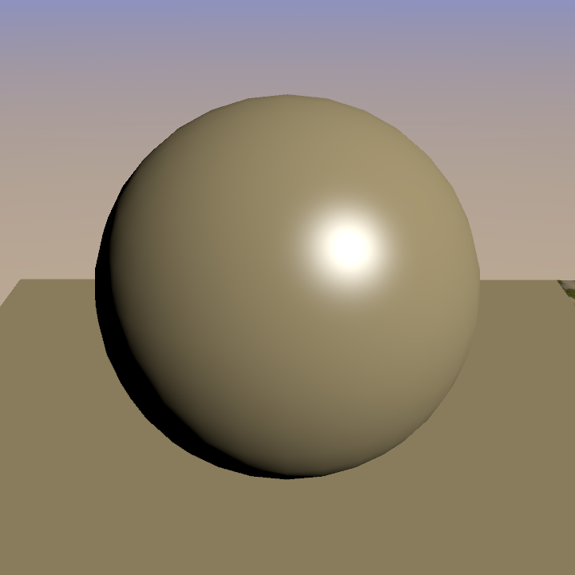
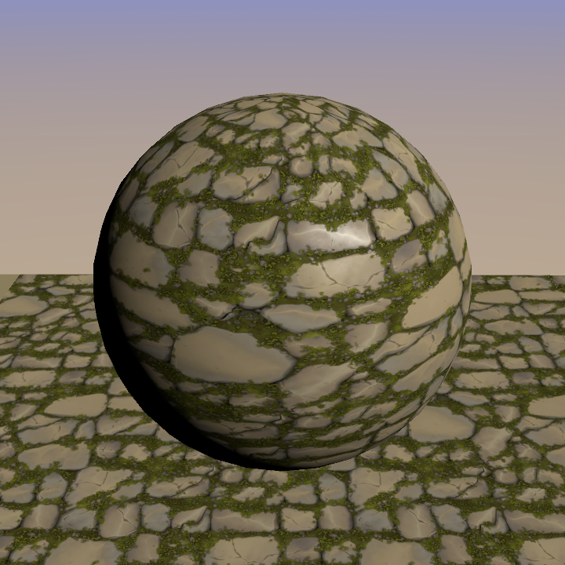
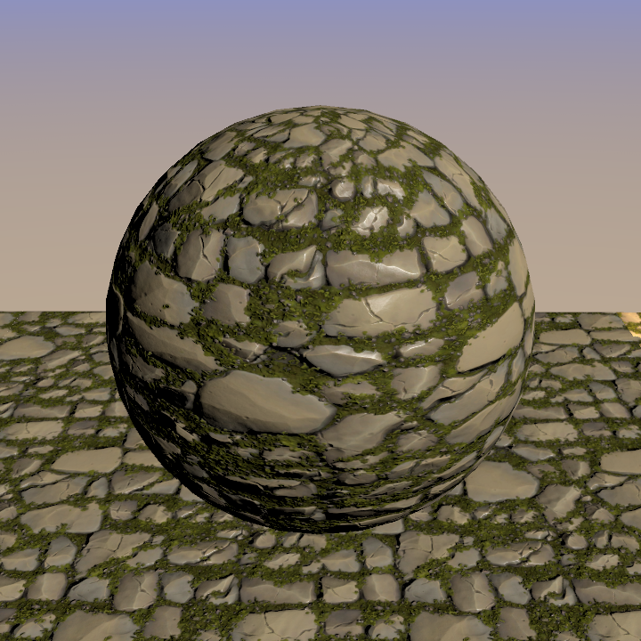
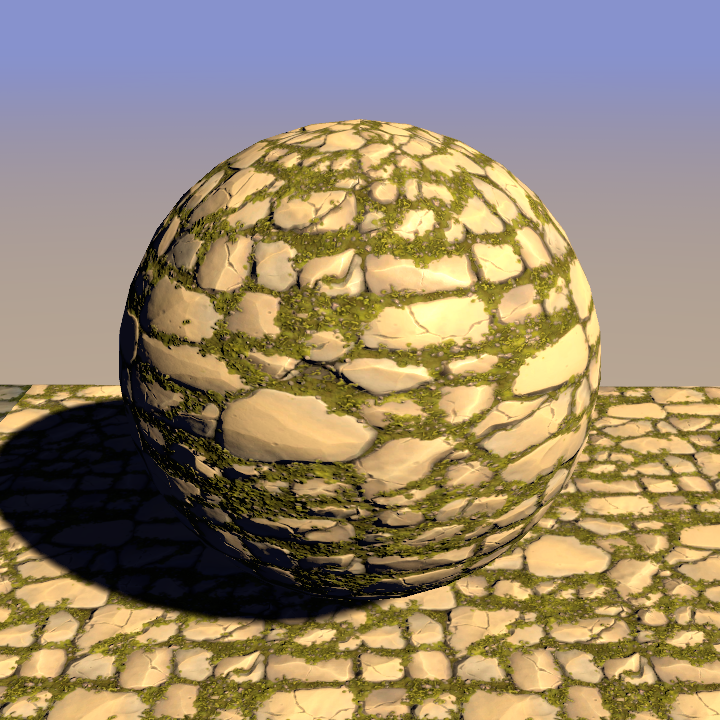
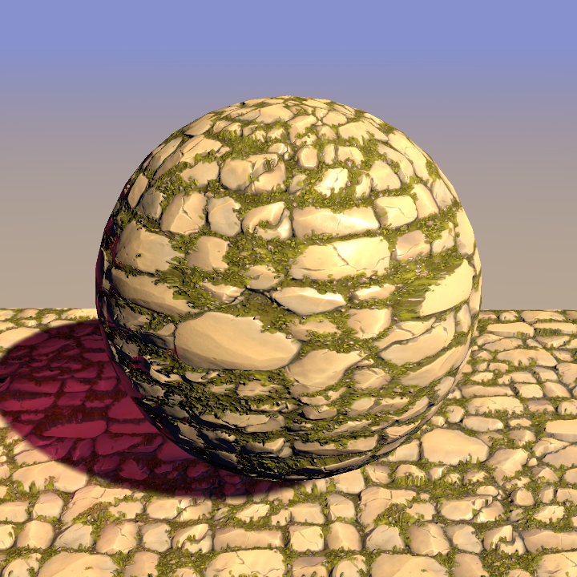
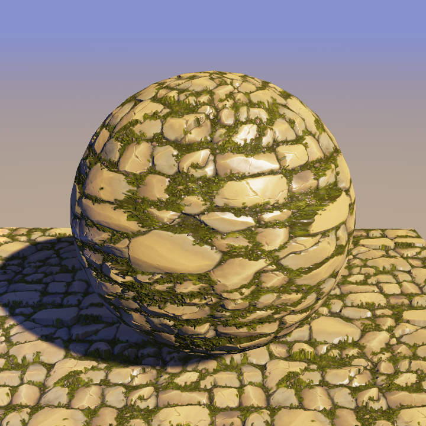
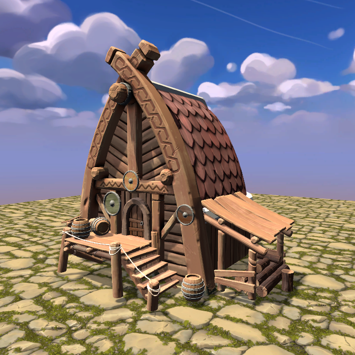

# Unity Blinn-Phong Shader

A Unity Built-in Render Pipeline shader project implementing a custom Blinn-Phong lit shader step by step.

本项目基于 Unity Built-in Render Pipeline，从基础光照开始，逐步实现一个自定义 Blinn-Phong 光照 Shader。

## Features

- Blinn-Phong diffuse and specular lighting
- Main texture sampling
- AO map
- SpecMask
- Normal map with TBN
- Shadow receiving and casting
- Parallax mapping
- ForwardAdd additional light support

## Progress

| Step | Preview |
|---|---|
| 1. Base Lighting<br>Basic diffuse, specular, and ambient lighting. |  |
| 2. Texture, AO, SpecMask<br>Main texture controls base color, AO darkens occluded areas, and SpecMask controls highlights. |  |
| 3. Normal Map<br>TBN converts tangent-space normal data into world space for per-pixel lighting detail. |  |
| 4. Shadow<br>ForwardBase receives shadows, and `Fallback "Diffuse"` provides shadow casting. |  |
| 5. Parallax And Additional Lights<br>Parallax offsets UVs with a height map, while ForwardAdd accumulates extra realtime lights. |  |
| 6. Final Shader<br>Texture, AO, SpecMask, normal map, parallax, shadows, and additional lights combined. |  |

## Scene Test

The shader is also tested on a small scene asset.



## Key Notes

### Blinn-Phong

```hlsl
half3 half_dir = normalize(light_dir + view_dir);
half spec_term = pow(max(0, dot(normal_dir, half_dir)), _Shininess);
```

`_Shininess` controls highlight sharpness, not just brightness.

### AO

```hlsl
final_color *= ao_color.rgb;
```

AO controls which areas become darker.

### SpecMask

```hlsl
spec_color *= spec_mask.rgb;
```

SpecMask controls where specular highlights are visible.

### Normal Map

```hlsl
half3 normal_data = UnpackNormal(normalmap);
normal_dir = normalize(mul(normal_data.xyz, TBN));
```

`UnpackNormal()` decodes normal-map color data into tangent-space normal direction.

### Parallax

```hlsl
uv_parallax = uv_parallax - (0.5 - height)
    * view_tangentspace.xy
    * _Parallax
    * 0.01;
```

Parallax mapping creates a depth illusion by offsetting texture UVs.

### ForwardAdd

```hlsl
Tags { "LightMode" = "ForwardAdd" }
Blend One One
```

ForwardAdd accumulates extra realtime lights and does not repeat ambient lighting.

## Notes

Tone mapping, Gamma correction, and ACES are better handled by post-processing or the render pipeline, so they are not treated as core material shader features in this project.
